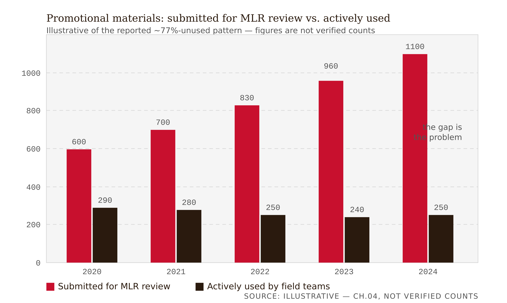
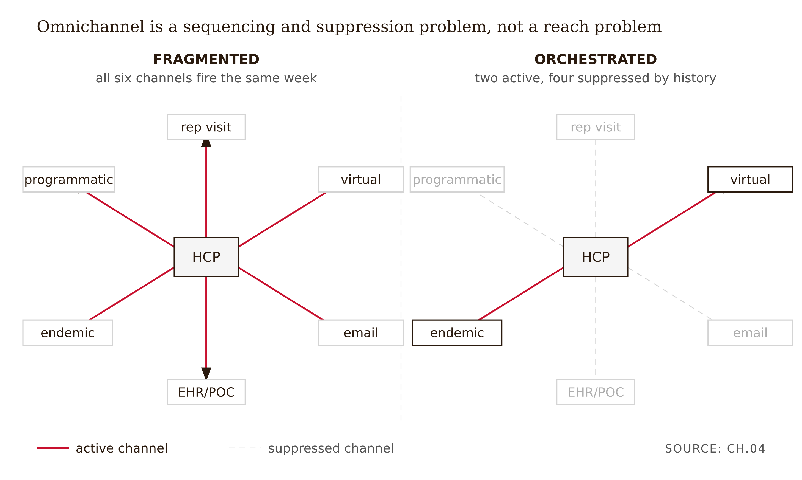
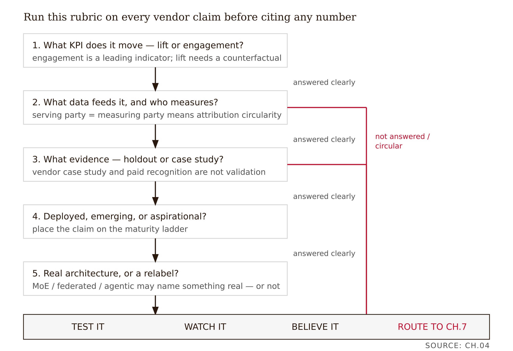

# Chapter 4 — What Today's AI Stack Actually Does (and Claims)
*A capability is real. An effectiveness claim is something else. Knowing the difference is the only professional skill that survives this market.*

Here is the problem with a pharma marketing-technology deck: it is not lying to you. That is what makes it hard.

A deck lands in your inbox. The headline reads: *"The world's first AI-powered operating system for healthcare marketing, powered by an adaptive Mixture of Experts."* Underneath are six capability tiles — NPI audience intelligence, conversational AI, SMART-on-FHIR workflow integration, creative-experience optimization, MLR acceleration, and federated learning across the network. A footer cites a Frost & Sullivan recognition and a "20:1 return on investment."

Your first instinct is suspicion, which is correct. But suspicion is not an audit, and dismissal would throw away the true part along with the false. The honest reading is more interesting than either credulity or cynicism, because the claim is *partly true* — and "partly true" is precisely the condition that requires you to do the work.

Take "operating system" first. Stripped of the swagger, this is a claim of platform consolidation: identity resolution, point-of-care ad inventory, programmatic buying, account-based marketing, co-pay programs, and analytics running on one unified data layer instead of six stitched-together vendors. That is a real, defensible architectural claim. Doceree — the platform whose language this echoes, which markets itself as "the world's first AI-powered Operating System for healthcare marketing" and consolidates these functions on 150+ direct EHR integrations plus a co-pay.com affordability layer (Doceree, PR Newswire, 2025) — genuinely consolidates these functions, though every effectiveness claim layered on top remains vendor-asserted. "Operating system" is a marketing flourish over a true plumbing fact.

Now take "adaptive Mixture of Experts." A Mixture of Experts is a real machine-learning architecture — specialized sub-models plus a router that decides which to activate — and we will dissect it properly in Chapter 7. Two things are true at once. First, the specific deployment is not independently verified; you have the vendor's word that a MoE is running and the vendor's word that it helps. Second, even if a genuine MoE is running, the underlying task here is NPI-level tabular prediction — which is precisely the regime where, as Chapter 6 will show, a well-tuned gradient-boosted tree ensemble is the state of the art and a MoE is likely indistinguishable from, or worse than, that boring baseline (Grinsztajn, Oyallon & Varoquaux, NeurIPS 2022). The architecture word may name something real and still tell you nothing about whether the system is any good.

And the "20:1 ROI"? A vendor-generated number, measured by the vendor, with no control group and no independent audit. The Frost & Sullivan recognition is paid industry recognition, not peer review.

Verdict before we go further: platform-consolidation claim, plausible. MoE superiority claim, unproven. ROI claim, un-evidenced. Every sentence on the deck can be literally accurate while the deck as a whole proves nothing about effectiveness. That coexistence — true sentences, no causal evidence — is the disease this chapter diagnoses.

---

## The maturity ladder

The single most useful move you can make with a capability deck is to sort each claim onto a three-rung maturity ladder and attach a KPI to each rung. Not because the ladder resolves anything, but because it forces you to ask the right prior question: is this *deployed*, or is this *described*?

**Deployed and mature.** Trigger-based point-of-care targeting. An ICD-10 diagnosis code fires inside the EHR and a contextual ad is delivered at or near the prescribing moment — the mechanism Chapter 1 traced through CDS Hooks and SMART on FHIR. This is the field's consensus current production capability, in use at scale, reliably producing higher HCP engagement than non-contextual digital placements. The capability is unambiguously real.

**Deployed at scale.** Predictive audience modeling — propensity models trained on claims data plus behavioral signals that identify high-potential HCPs before a prescribing event, so a brand can reach them early. OptimizeRx's DAAP, Doceree's intelligence layer, and IQVIA's OCE+ (with its "Next Best" recommendation engine) are production examples (vendor documentation, optimizerx.com and iqvia.com). The KPI is engagement or new-to-brand prescriptions. The modeling is genuine. Whether it *causes* incremental scripts is a separate question, and it is the question Chapter 8 is built to answer.

**Deployed but task-scoped.** Next-Best-Action recommendation — an AI system recommending which HCP, which channel, which message, at which moment, with the field rep as the human delivery mechanism for the AI-orchestrated sequence. Veeva's AI Agents for Vault CRM (announced October 2025, available December 2025) and IQVIA's agentic NBA work — extended into the IQVIA.ai platform co-developed with NVIDIA (announced March 2026) — are concrete, dated examples (Veeva and IQVIA press releases, 2025–26). The crucial nuance: "agentic" in this wave mostly means task-assistive. Drafting call reports. Surfacing treatment barriers from rep notes. Speeding CRM work. Not autonomous analytical decision-making. A very good intern, not an autonomous analyst.

**Emerging and contested.** MLR acceleration and AI-assisted content generation — AI pre-screens promotional content for incomplete claims or missing references, links copy to pre-approved claims libraries, and drafts reviewer summaries. Veeva's PromoMats Quick Check Agent and Content Agent (introduced in the 25R3 release, 2025) are examples (Veeva, veeva.com). Whether this actually compresses cycle time at the claimed rate is genuinely uncertain — Veeva itself estimates "up to 75%" faster reviews, a vendor projection, not an independent measurement — and we will sit with that uncertainty in the next section rather than resolve it prematurely.

**In press releases.** Federated learning for targeting models — training on distributed patient data without centralizing it. Vendors reference it. Whether it is running at production scale in this market is not demonstrated by any source independent of the vendors themselves. Treat it as aspirational until shown otherwise.

| Capability | Maturity rung | Target KPI | Evidence type available | Verdict |
|---|---|---|---|---|
| Trigger-based point-of-care targeting | Deployed and mature | HCP engagement at point of care | Vendor case studies | Real capability; effect size unproven |
| Predictive audience modeling | Deployed at scale | Engagement / new-to-brand scripts | Vendor-generated (same NPI infrastructure serves and measures) | Real modeling; incremental causal effect untested |
| Next-Best-Action recommendation | Deployed but task-scoped | Call response / new-to-brand scripts | Vendor-generated | Real, but task-assistive — not autonomous decision-making |
| MLR acceleration | Emerging and contested | Review cycle time | Internal operations data; conflicting vendor/analyst figures | Speed plausible; value-add genuinely uncertain |
| Federated learning for targeting | In press releases | None demonstrated | Vendor reference only; no independent confirmation | Aspirational until shown otherwise |

*Table 4.1 — The maturity ladder applied to the current production stack. Note that "evidence type available" is vendor-generated for every row — that is the shared vulnerability.*

The misconception to kill on sight: if a vendor names a capability, it is deployed and proven. Capabilities in this market are mostly real. Effectiveness claims attached to them are mostly not independently validated. Those are different sentences, and conflating them is the professional error this book exists to prevent.

---

## What Next-Best-Action actually computes

NBA deserves a precise definition because the gap between what it does and what the brochure implies is especially wide.

An NBA system ingests claims data, behavioral engagement signals, and calendar and territory constraints. It outputs a ranked recommendation: this HCP, this channel, this message, this week. The rep executes it. The target KPI is engagement, call response, or new-to-brand prescriptions.

Here is the misconception worth dwelling on, because it recurs across the whole book: **NBA optimizes for reachable responders, not for patients who most need the drug.** The system scores physicians by engagement-likelihood — who is most likely to open an email, take a call, respond to a POC card. That is an optimization over the marketer's objective function, which is efficient engagement. It is not an optimization over clinical appropriateness. A physician who is highly responsive to commercial messages and a physician who is treating the highest-burden patients are different physicians, and NBA reliably finds the former.

This inversion matters for the same reason the split-agency structure in Chapter 1 matters. The system is genuinely good at its actual job. Its actual job is just not the one the brochure implies.

The 2025–26 "agentic" framing is real but should be read carefully. When Veeva announces an "Agentic Call Report" that surfaces treatment barriers from a rep's visit notes, that is a genuine productivity tool — it saves the rep from administrative work and surfaces clinically relevant signals the brand team wants. The effectiveness claim grafted onto it — "better engagement coordination leads to more scripts" — is exactly the claim that requires a holdout group to test. No independent study supplies one.

---

## MLR acceleration — the most contested ROI in the stack

MLR review — the Medical, Legal, and Regulatory gate every piece of promotional content must pass before a rep can carry it or a platform can run it — is widely reported by mid- and large-sized pharma companies to take roughly 50 to 60 days per piece under current workflows (industry/vendor reporting, e.g., Vodori, Caidera). AI is being deployed to compress that: pre-screening for incomplete claims, flagging missing references, linking copy to pre-approved claims libraries, routing low-risk modular content, and drafting reviewer summaries so the human committee can move faster.

The consensus implementation pattern is Human-in-the-Loop: AI does the quantitative checks, humans keep the contextual and ethical judgment. This is the right architecture for the task, and the operational deployment is real.

Now hold two numbers in tension and resist resolving them.

McKinsey has cited a 50 to 65 percent reduction in regulatory-submission timelines at some companies through AI-enabled automation and workflow redesign (McKinsey, life-sciences insights, mckinsey.com).

<!-- FACT-CHECK FLAG: UNVERIFIED — see factchecks/04-what-todays-ai-stack-does-assertions.md --> An MIT report — "The GenAI Divide: State of AI in Business 2025," from the MIT NANDA initiative — found that roughly 95 percent of enterprise generative-AI pilots deliver no measurable P&L impact (MIT NANDA, 2025). Both circulate without fully transparent, comparable methodology. They appear to describe different populations, different task definitions, or different stages of the same adoption curve. The honest move is to present both, attribute both, and treat neither as settled.

A third datum reframes the whole thing. Promotional-content production keeps rising — Veeva's 2025 Pulse data reports pharma companies producing roughly 20 percent more content each year — while about 77 percent of field content is never used by reps (Veeva Pulse, 2025). Volume is up. Value is not obviously up. The real constraint in MLR is not speed — it is governance and relevance. If 77 percent of what clears review never gets used, faster generation makes the governance problem worse, not better. "50% faster MLR" is an answer to a question nobody asked.


*Figure 4.1 — The MLR governance gap (illustrative)*

<!-- → [CHART: Two-bar chart per year, 2020–2024 — left bar: total promotional materials submitted for MLR review; right bar: materials actively used by field teams. Caption: "If the 77%-unused figure is accurate, speed is not the binding constraint. The chart makes the governance problem visible as the gap between bars."] -->

So when a company reports faster MLR review times, the audit questions write themselves: faster on which content tiers? Measured how? Did the rejected-content rate change? Did the rate of post-launch FDA enforcement letters change? That last question matters. The FDA's September 2025 enforcement wave — roughly 60 letters issued on September 9, 2025 (about 8 Warning Letters and 53 Untitled Letters), announced alongside HHS and explicitly invoking advanced technology for proactive surveillance — targeted exaggerated efficacy claims and inadequate fair balance / risk disclosure (FDA/HHS press release and fact sheet, Sept. 9, 2025; King & Spalding and Covington advertising-enforcement reviews, 2025–26). AI-accelerated content generation, if ungoverned, scales the production of problematic content as fast as it scales the production of clean content. The FDA is now using AI to catch what AI is generating.

---

## Omnichannel — coordination, not ubiquity

Physician access changed permanently after COVID. Industry access-tracking (ZS AccessMonitor and similar trackers) has documented a long downward slide — by the mid-2010s only a minority of physicians were fully "rep-accessible," and more than half now restrict access to some degree, with a substantial share limiting access to a single brand. [verify — unconfirmed: the specific "45% available / ~30% single-brand-restricted by early 2024" figures did not resolve to a current ZS primary release; the documented trend is rising restriction.]

<!-- FACT-CHECK FLAG: UNVERIFIED — see factchecks/04-what-todays-ai-stack-does-assertions.md --> The channel mix shifted accordingly: in-person reps declining, remote detailing normalized, email high-volume but low-engagement, EHR point-of-care the fastest-growing and highest-conversion channel, endemic digital (Medscape, Doceree's physician network) high-trust but moderate-scale, programmatic open web broad-reach but low-conversion.

Omnichannel orchestration is the coordination of all those channels for a single HCP so the brand experience is coherent rather than overwhelming. NBA decides which channel each physician is most responsive to, suppresses channels where they are not, and sequences messages so the rep call and the EHR trigger and the email reinforce each other rather than firing simultaneously and competing for the physician's attention.

The misconception is that omnichannel means being everywhere. It does not. It means coordination. A physician hit in one week by a rep visit, two emails, retargeting banners, and an EHR trigger has a fragmented brand experience, not an omnichannel one. Orchestration exists precisely to prevent that. In practice: a physician who ignores email but engages endemic content gets email suppressed and a Medscape placement plus a virtual detail prioritized. The system is adjusting in real time to revealed preference — which is genuinely useful, and which is still optimizing for the marketer's objective, not the patient's.


*Figure 4.2 — Omnichannel is sequencing and suppression, not reach*

<!-- → [DIAGRAM: Single HCP at the center; radiating lines to six channels (in-person rep, virtual detail, email, EHR/POC card, endemic digital, programmatic). Two versions side by side: left labeled "fragmented" (all channels firing same week); right labeled "orchestrated" (two channels active, four suppressed based on engagement history). Caption: "Omnichannel is a sequencing and suppression problem, not a reach problem."] -->

---

## The audit: five questions for any claim

This is the chapter's named artifact and the structure the rest of the book uses. For any capability claim, run five questions in order.

**One: what KPI does it actually move?** Is the claimed outcome *lift* — incremental prescribing above what would have happened without the intervention — or *engagement* — a physician opened an email, clicked a card, took a meeting? These are very different. Engagement is a leading indicator at best. Lift requires a counterfactual (Chapter 5). Many claims measure the former and imply the latter.

**Two: what data feeds it, and who measures the result?** This is where attribution circularity lives. If the platform that serves the ad is also the platform that observes the prescribing and reports the lift, there is no independent firewall. The party with a commercial interest in a high number is producing the number. Every script-lift figure in this market — the range runs from 4 percent to 44 percent — is vendor-generated in exactly this way. This does not make the numbers false. It makes them uninformative about causal effect.

**Three: what evidence?** A vendor case study is not peer-reviewed evidence. An industry-association recognition is not independent validation. A randomized holdout, pre-registered, measured by a party with no stake in the outcome — that is evidence.

**Four: deployed, emerging, or aspirational?**

**Five: does a buzzword name a real architecture, or is it a relabel?** "Mixture of Experts" may name a real system. It does not tell you whether that system outperforms a gradient-boosted tree on tabular NPI data. "Federated learning" may describe real infrastructure. It does not tell you whether the resulting model is better than a centrally trained one. "Agentic" may describe real task automation. It does not tell you whether the tasks being automated are the binding constraint on commercial effectiveness.


*Figure 4.3 — The five-question audit rubric for any vendor claim*

<!-- → [INFOGRAPHIC: Five-question audit rubric as a vertical flowchart — each question in a box, with branch paths for "answered clearly" vs. "not answered / circular" — converging at a bottom verdict: test it / watch it / believe it / route to Chapter 7. Caption: "Run this rubric on every vendor claim before citing any number."] -->

A useful economic frame: AI makes prediction cheap. It does not supply judgment, and it does not guarantee a business outcome. "The model predicts X" and "the platform achieves outcome Y" are different claims. The gap between them is where the audit lives (Agrawal, Gans & Goldfarb, *Prediction Machines*, 2018).

---

## The deck, audited tile by tile

Return to the opening deck. The first pass — dismissing the whole thing as hype — was the wrong move, and it is worth seeing why. Blanket cynicism would have discarded the true part (genuine platform consolidation, genuinely deployed trigger targeting) along with the unproven part. The Fellow's value is precision, not attitude.

The second pass runs the rubric on each tile.

Trigger and SMART-on-FHIR targeting: deployed and mature. KPI is engagement at the point of care. Data is vendor-served and vendor-measured — attribution circular. Evidence is vendor case studies. Verdict: real capability; effect size unproven.

Predictive audience and NBA: deployed at scale. KPI is engagement and new-to-brand scripts. Same NPI infrastructure serves and measures. Evidence is vendor-generated. Verdict: real capability; incremental effect untested (Chapter 8).

MLR acceleration: emerging and contested. KPI is cycle time. Data is internal operations data. Evidence conflicts — McKinsey vs. MIT, neither methodology transparent. Verdict: speed plausible; value-add genuinely uncertain.

Federated learning: aspirational at scale. No KPI demonstrated. No independent evidence. Verdict: treat as aspirational.

"Adaptive MoE routing": architecture claim. Implies accuracy improvement. No independent evidence. Verdict: possibly a real architecture; superiority on this task unproven (Chapter 7).

Conversational AI: emerging. KPI is engagement. Evidence is vendor-only. Verdict: real capability; effect unproven.

The 20:1 ROI: labeled and set aside. Un-controlled vendor number. The Frost & Sullivan badge: labeled and set aside. Paid recognition.

The lesson is that a single deck contains capabilities at every rung of the ladder, and the honest verdict is heterogeneous. The audit does not collapse to a single score. It produces a capability-by-capability map that a product team can actually use — which is what a vendor scorecard cannot do and which is why the audit is the Fellow's first artifact.

The limit: this audit tells you what is plausible and what is unproven. It cannot tell you what is true. That requires the control group and the independent measurement that Chapters 5, 6, and 8 build toward. The audit is the entry ticket to the evidence problem, not its resolution.

---

## What would change my mind

The chapter's central thesis — that most effectiveness claims in this market are not independently validated — would require revision if an independent party, academic or regulatory, with no data dependency on the platform, published a pre-registered controlled evaluation of an EHR or NBA capability and found the vendor's effect size held up. One credible independent replication of a script-lift figure in a peer-reviewed venue would move the whole category from "real capability, unproven effect" toward "real and evidenced." None exists today. The absence is the point, and it is falsifiable.

## Still puzzling

If MLR acceleration genuinely cuts cycle time, why does 77 percent of approved content go unused — is the bottleneck never speed, always relevance? If so, what is the AI actually buying the brand?

The MIT "95% of pilots fail" and McKinsey "50–65% faster" figures cannot both describe the same reality cleanly. Which subset of work does each describe, and can anyone produce the methodology?

"Agentic" tooling is task-assistive today. What is the first NBA decision a Fellow would trust an agent to make autonomously, and what evidence would that trust require?

---

## Exercises

**Warm-up**

1. *(Recall — tests the maturity ladder)* List the five capability types from the chapter and assign each a maturity rung (deployed / emerging / aspirational) and a target KPI from memory, then check yourself. Where you disagree with the chapter's placement, write one sentence defending your choice. *What this tests: whether you can sort capabilities without collapsing them into a single verdict.*

2. *(Recall — tests attribution circularity)* Define attribution circularity in one sentence. Then name the specific structural feature of the pharma marketing stack — described in Chapter 1 — that makes circularity the default rather than the exception. *What this tests: whether you can connect the audit rubric to the split-agency anomaly.*

3. *(Recall — tests the NBA inversion)* What does Next-Best-Action actually optimize for, and why is that different from what the brochure implies it optimizes for? *What this tests: whether you can state the inversion precisely without dismissing the system as useless.*

**Application**

4. *(Apply — runs the five-question rubric)* Find a real, public pharma-platform capability page. For each capability claimed, fill in the five-question rubric in a table: KPI, data source, evidence type, maturity rung, buzzword flag. Add a one-line verdict per row. *What this tests: whether you can operationalize the rubric on actual vendor material.*

5. *(Apply — MLR acceleration)* A brand reports "50% faster MLR review" after deploying AI-assisted content pre-screening. Write the three follow-up questions you would need answered before citing that figure, and name the specific independent party who would have to measure each answer. *What this tests: whether you can generate the audit questions a vendor result demands rather than accepting it as stated.*

6. *(Apply — omnichannel)* Describe the difference between a fragmented multi-channel campaign and a genuinely orchestrated omnichannel campaign for a single HCP. Give a concrete example of each using at least three channels. *What this tests: whether you understand orchestration as a sequencing and suppression problem rather than a reach problem.*

**Synthesis**

7. *(Synthesize — capabilities + evidence)* A product manager asks you to evaluate two vendor pitches: Vendor A claims "deployed NBA with 18% engagement lift, Frost & Sullivan recognized." Vendor B claims "emerging predictive-audience modeling, no lift figures yet, methodology available on request." Write a one-page evaluation memo recommending which vendor to run a pilot with and why. Your memo must use the maturity ladder, the five-question rubric, and the attribution-circularity frame. *What this tests: whether you can synthesize the chapter's tools into a decision-relevant output.*

8. *(Synthesize — the stack end to end)* Connect the capability inventory in this chapter to the split-agency structure in Chapter 1. For each capability (POC targeting, NBA, MLR acceleration, omnichannel), state which party in the prescriber/patient/payer/institution split benefits, which party bears the cost or risk, and whether the capability narrows or widens the gap between commercial optimization and patient welfare. *What this tests: whether you can trace commercial AI capabilities back to the structural anomaly the book opened with.*

**Challenge**

9. *(Challenge — design an independent evaluation)* Design a study that would produce credible causal evidence that NBA-coordinated omnichannel engagement increases *clinically appropriate* prescribing — not just branded prescribing volume. Specify the comparison group, the outcome measure, the randomization unit, the measurement party, and the primary threat to validity. You do not need to solve the threat — name it and explain why it is the hardest one. *What this tests: whether you can specify the evidence standard the market currently lacks and articulate why producing it is genuinely hard.*

---

## Prompts

### Figure 4.1 — The MLR governance gap (illustrative)

Build a single self-contained HTML file using D3 7.9.0 from the cdnjs CDN. Render a grouped vertical bar chart, five year-groups on the x-axis (2020 through 2024), two bars per group: "submitted for MLR review" and "actively used by field teams." Y-axis is count of promotional materials, baseline at zero (mandatory). Keep year order chronological left to right; do not sort by value. Use one red data series for "submitted" and a dark-ink series for "used"; label each bar with its value. Annotate the gap between the two bars in each group with a thin connector and a small "unused" note on the widest gap. Add a caption stating the figures are illustrative of the reported ~77%-unused pattern, not verified counts — never present them as fact. Deliverable: one HTML file, inline CSS, CSS-variable theming with light/dark media query, D3 7.9.0 only.

### Figure 4.2 — Omnichannel is sequencing and suppression, not reach

Build a single self-contained HTML file using D3 7.9.0 from the cdnjs CDN. Render two side-by-side radial node-link diagrams sharing one central HCP node. Each panel has six channel nodes (in-person rep, virtual detail, email, EHR/POC card, endemic digital, programmatic) on a circle around the center, connected by straight edges. Left panel "fragmented": all six edges active (solid, red-accented). Right panel "orchestrated": two edges active (solid), four suppressed (dashed, grayed, lowered opacity). Label each channel node; label the two panels. No axes. Interactive: hovering or focusing a channel node shows a tooltip with its engagement state. Deliverable: one HTML file, inline CSS, CSS-variable theming with light/dark media query, D3 7.9.0 only.

### Figure 4.3 — The five-question audit rubric for any vendor claim

Build a single self-contained HTML file using D3 7.9.0 from the cdnjs CDN. Render a top-to-bottom flowchart: five question boxes in sequence (KPI moved; data and measurer; evidence type; deployment stage; buzzword vs. architecture), each with two labeled branch edges — "answered clearly" and "not answered / circular." All branches converge on a bottom verdict band with four outcomes: test it, watch it, believe it, route to Chapter 7. Use ink for boxes, red only to mark the "circular" failure path. Arrowheads on every edge; no label on an arrow centerline. Interactive: clicking a question box highlights its downstream path. Deliverable: one HTML file, inline CSS, CSS-variable theming with light/dark media query, D3 7.9.0 only.

---

## Chapter 4 Exercises: What Today's AI Stack Does

**Project:** One Drug, End to End
**This chapter adds:** Inventory and classify the AI-stack tools a brand team would actually run for your drug — sorting each onto the maturity ladder and through the five-question audit.

### Exercise 1 — When to Use AI

**The judgment:** Three chapter tasks where AI assistance is appropriate.

- *Extracting every capability and effectiveness claim from a vendor capability page into rows.* **Why AI works here:** reformatting — turning prose into a structured claims table you then audit.
- *Drafting a maturity-ladder placement for each tool your drug's team would use* (deployed / emerging / aspirational). **Why AI works here:** drafting — a first-pass sort you correct against the chapter's Table 4.1.
- *Flagging architecture buzzwords* (MoE, federated learning, agentic, "operating system") in a deck. **Why AI works here:** pattern-spotting — surfacing the relabel terms so you can decide if each names a real architecture.

**The tell:** You are using AI appropriately when you can independently evaluate the output — when the maturity rating and circularity flag are still yours to assign.

### Exercise 2 — When NOT to Use AI

**The judgment:** Three tasks here that require human judgment.

- *Assigning the final maturity verdict and circularity flag to each tool.* **Why AI fails here:** calibration gap — the model will call a vendor case study "evidence" because it contains numbers, mistaking fluency for proof.
- *Deciding whether a tool's claimed effect on your drug's scripts is real.* **Why AI fails here:** causal-identification problem — effect size requires a holdout the deck never contains, and the model cannot conjure the missing counterfactual.
- *Reconciling the McKinsey "50–65% faster" vs. MIT "95% of pilots fail" figures.* **Why AI fails here:** missing ground truth — both circulate without transparent methodology, and the model will pick a winner it cannot justify.

**The tell:** You've crossed the line when AI output is your *reason* for a conclusion rather than a tool for reaching one.
**Series connection:** This trains **T4 Metacognitive** judgment — running the audit rubric yourself and refusing to let "the model said it's mature" stand in for an evidence verdict.

### Exercise 3 — LLM Exercise

**What you're building this chapter:** An AI-stack inventory for your drug — every tool a brand team would run, each placed on the maturity ladder and run through the five-question audit, with verdicts you assign.
**Tool:** Claude. Recommend a **Claude Project** — your drug identity and prior chapters' outputs let the inventory name the specific tools that fit this drug's channels.

**The Prompt:**

```
We are continuing a teaching case study for a branded SGLT2 inhibitor (type 2
diabetes; class has branded competitors and a generic substitute). From earlier
chapters we have its prescriber set, its lift-vs-equity profile, and its
synthetic identity graph.

Inventory the AI-stack tools a brand team would plausibly run for THIS drug, then
audit each. Rules: capabilities are mostly real; effectiveness claims mostly are
not independently validated — keep those separate. Invent NO numbers; label any
vendor figure "[verify]" and never present it as fact.

1. TOOL INVENTORY. List the capability categories from the maturity ladder
   relevant to this drug: trigger-based point-of-care targeting, predictive
   audience modeling, next-best-action, MLR acceleration, omnichannel
   orchestration, conversational AI, federated learning. For each, name the kind
   of vendor product that delivers it and the channel it serves for this drug.

2. MATURITY LADDER. Place each on a rung: deployed-and-mature, deployed-at-scale,
   deployed-but-task-scoped, emerging-and-contested, or in-press-releases. Give
   the target KPI and the evidence type available.

3. FIVE-QUESTION AUDIT. For each tool, run: (1) what KPI does it move — lift or
   engagement? (2) what data feeds it and who measures the result (attribution
   circularity)? (3) what evidence? (4) deployed/emerging/aspirational? (5) does
   any buzzword name a real architecture or relabel something ordinary?
   End each tool with a one-line verdict (e.g., "real capability; effect size
   unproven").

Output as a markdown table. Do NOT assess whether any effectiveness claim is
true — only classify and flag. End with the one tool whose claimed effect on this
drug you would most want an independent holdout to test.
```

**What this produces:** A maturity-rated, audited AI-stack inventory for your drug with per-tool verdicts.
**How to adapt this prompt:** *For your own drug:* swap the drug/class line and your prior-chapter findings; keep the ladder and five questions. *For ChatGPT/Gemini:* paste in one message; re-state the "capabilities real, effectiveness unvalidated" rule at the top. *For a Claude Project:* keep the drug identity and the audit rules in Project instructions; send only the three numbered tasks.
**Connection to previous chapters:** The identity graph (Chapter 3) is the data these tools run on; the lift-vs-brand distinction (Chapter 2) drives audit question 1. **Preview of next chapter:** In Chapter 5 you will grade the evidence behind these tools' claims for your drug using the evidence taxonomy.

### Exercise 4 — CLI Exercise

**What you're building this chapter:** A reproducible claims-vs-citations ratio across three real vendor pages for your drug's tool category — counting quantified effectiveness claims against independently sourced ones. · **Tool:** Claude Code (multi-file grep over saved pages). · **Skill level:** Beginner/Intermediate.

**Setup:**
1. Save three public vendor capability pages (for tools your drug's team would use) as `vendor1.txt`, `vendor2.txt`, `vendor3.txt` in `one-drug/vendors/`.
2. Claude Code installed.
3. Add a CLAUDE.md rule: "Vendor figures are [verify] until the primary source is opened; count, do not endorse."

**The Task:**

```
In one-drug/vendors/, using vendor1.txt, vendor2.txt, vendor3.txt, do only this:

1. Count quantified effectiveness claims across all three:
   grep -i -E "lift|roi|x return|increase|%" vendor1.txt vendor2.txt vendor3.txt | wc -l
2. Count claims carrying an independent citation:
   grep -i -E "doi|pubmed|ncbi|journal" vendor1.txt vendor2.txt vendor3.txt | wc -l
3. Write ch04-vendor-claims.md with: the two counts, the ratio (independent
   citations per quantified claim), the exact grep commands used, and a one-line
   verdict on what that ratio says about evidence density in this tool category
   for my drug.

Do not edit the vendor files. Do not endorse any number — label all as [verify].
Verification: paste the actual matched lines for the citation grep so I can
confirm they are real citations, not the word "journal" in prose. Stop after
writing the markdown.
```

**Expected output:** `ch04-vendor-claims.md` with the claim count, citation count, ratio, commands, and the matched citation lines.
**What to inspect:** The matched citation lines — confirm they are genuine references, not incidental uses of "journal" or "%"; the ratio is only meaningful if the matches are real.
**If it goes wrong:** Most likely failure is inflated citation counts from false-positive matches (e.g., "%" inside CSS or "journal" in a nav menu). Recovery: tighten the regex (require "doi.org" or "pubmed.ncbi") and re-count — don't report a flattering ratio built on junk matches.
**CLAUDE.md / AGENTS.md note:** Add "Claim/citation counts must include the matched lines so false positives are visible."

### Exercise 5 — AI Validation Exercise

**What you're validating:** The AI-stack inventory and audit from Exercise 3 (maturity placements and circularity flags). · **Validation type:** Reasoning + Structured-data. · **Risk level:** Med/High — a tool wrongly graded "proven" will get a budget recommendation in later chapters.

**Setup:** Use your Exercise 3 output as the artifact.

**The Validation Task:**

```
Validation Checklist — Chapter 4 (AI-Stack Inventory + Audit)

Mark each Pass / Fail / Cannot-determine with one line of evidence:

- Correctness: Is each tool's maturity rung consistent with the chapter (e.g.,
  federated learning = aspirational, trigger POC = deployed-and-mature)?
- Completeness: Does every tool have a KPI, an evidence type, AND a verdict?
- Scope: Did it classify and flag only, without asserting any effectiveness
  claim is true?
- Chapter-specific 1 (KPI type): For each tool, is the KPI correctly labeled
  lift vs. engagement?
- Chapter-specific 2 (circularity): Is attribution circularity flagged wherever
  the serving platform also measures the result?
- Failure-mode check (fluent-but-wrong + vendor-claim laundering): Did it upgrade
  a vendor case study to "evidence," treat a Frost & Sullivan-style badge as
  independent validation, or state a [verify] number as fact?
```

**What to do with your findings:** Pass → use the inventory. One fail → fix that row's verdict and re-run. Multiple/uncertain → re-run the five-question audit yourself on the disputed tools; this is a "When NOT to Use AI" moment, because the maturity verdict and circularity flag are the chapter's core human skill.
**AI Use Disclosure prompt (mandatory):** Two sentences — what the AI produced (e.g., "drafted the tool inventory and ladder placements") and how you used it, plus one thing it couldn't determine (e.g., "whether a vendor's claimed lift for my drug is real, which needs a holdout I noted is absent").
**Series connection:** Trains detection of **vendor-claim laundering** under **T4 Metacognitive** judgment — keeping "capability is real" and "effect is proven" as two separate sentences.

## References (fact-check pass)

1. Grinsztajn L, Oyallon E, Varoquaux G. Why do tree-based models still outperform deep learning on typical tabular data? NeurIPS 2022 (Datasets & Benchmarks). https://arxiv.org/abs/2207.08815
2. MIT Project NANDA. The GenAI Divide: State of AI in Business 2025. July 2025. https://mlq.ai/media/quarterly_decks/v0.1_State_of_AI_in_Business_2025_Report.pdf
3. King & Spalding. HHS and FDA Declare "Crackdown" on Drug Advertising and Promotion. 2025. https://www.kslaw.com/news-and-insights/hhs-and-fda-declare-crackdown-on-drug-advertising-and-promotion
4. Agrawal A, Gans J, Goldfarb A. Prediction Machines: The Simple Economics of Artificial Intelligence. Harvard Business Review Press, 2018.
