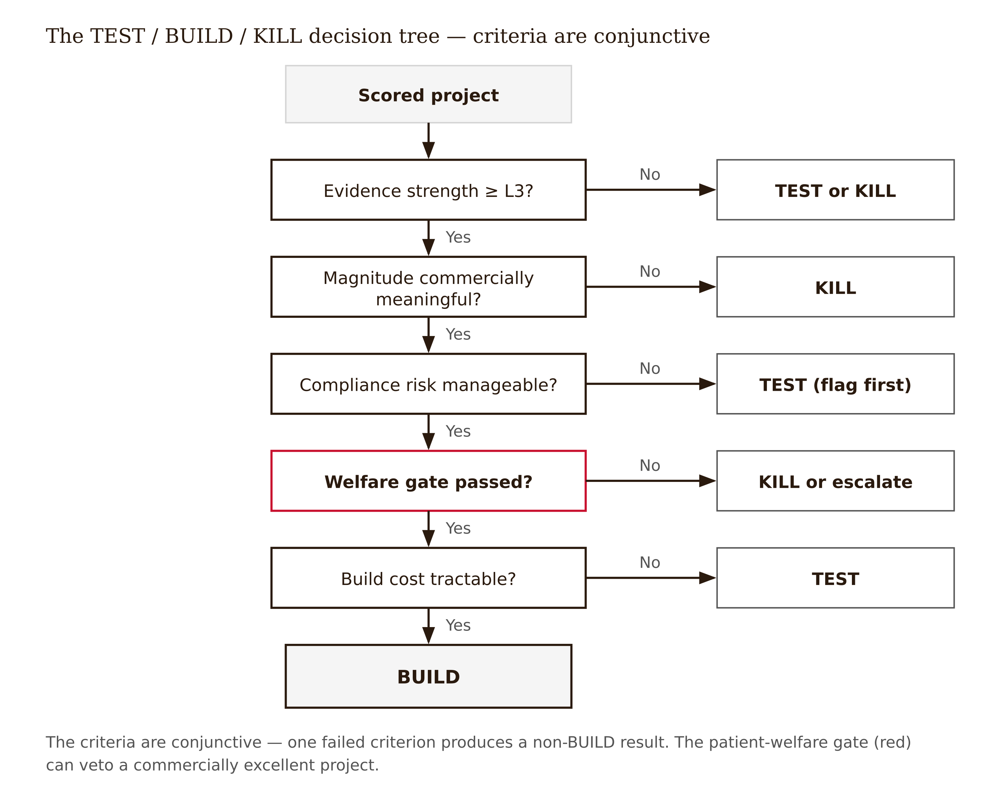

# Chapter 14 — From Prototype to Product Decision (The Fellow's Brief)
*A good "no" is as valuable as a build recommendation — and harder to write.*

A Fellow brings the lab a prototype she is proud of. It is an AI-driven content-personalization model for point-of-care messaging, and on her public-data proxy it shows a clean, statistically significant lift in engagement — opens, clicks, dwell time, the metrics the platform reports natively. The vendor deck would call this a win. She is inclined to write a BUILD brief.

The lab lead asks three questions, in order.

"Engagement, or incrementality?" The model lifts the surrogate, but there is no holdout, no credible identification. She cannot say whether it changed any prescribing. Engagement is not belief and is not scripts — that distinction was Chapter 2's whole argument. On the Evidence Ladder she is at Level 2, maybe 3: an offline result on a surrogate, not a causal readout on the outcome that matters.

"What does it touch?" The personalization fires content into the EHR sidebar — the same visual layer as drug-interaction and safety alerts. That is a compliance flag (FDA fair-balance risk if the content makes product claims; an unsettled HIPAA question about real-time clinical triggers) and a patient-welfare flag (intensifying commercial messaging in the safety-alert layer raises cognitive load at the exact moment a prescribing decision is being made).

"If we hand this to engineering and it ships, what would we be shipping?" A feature that demonstrably moves a surrogate, has no evidence it moves the real outcome, and lives in the most ethically fraught layer in the stack.

The right call is not BUILD. It is **TEST** — the engagement signal is promising enough to justify the partner running a proper holdout on proprietary data, the only thing that can produce the causal readout public data cannot, *conditioned on* clearing the fair-balance and welfare flags first. And if the partner's holdout later showed lift was engagement-only — surrogate movement with no prescribing change — and the content tripped fair-balance, the verdict would flip to KILL regardless of how good the engagement number looked.

That is the machinery this chapter produces: the brief that generates this call, and the welfare gate that can override a positive commercial result.

---

Before the mechanics, a structural fact worth holding clearly: the Fellow's job ends at the gate-1-to-gate-2 handoff.

The four-stage research-to-product pipeline maps cleanly to the Evidence Ladder. Stage 1 is open research — the Fellow's stage, public data and public methodology, topping out around Level 3. Stage 2 is proprietary replication — the *partner* re-runs the promising method on its internal data, running the prospective holdout the Fellow could only gesture at. Stage 3 is a working prototype inside the partner's environment. Stage 4 is a monitored, resourced deployment.

| Stage | What happens | Who owns it | Evidence Ladder level |
|---|---|---|---|
| 1 — Open research | Fellow tests on public data | Fellow | L0–L3 |
| 2 — Proprietary replication | Partner runs holdout on internal data | Partner | L4 |
| 3 — Prototype | Built artifact in client context | Partner | L5 |
| 4 — Resourced feature | Monitored deployment | Partner | L6 |

*Table 14.1 — The four-stage research-to-product pipeline (firewall between Stages 1 and 2)*

The Chapter 14 brief is precisely the gate-1-to-gate-2 handoff document. It answers one question: does this public-data result earn the partner's data and engineering investment? The Fellow who tries to build the feature has confused the role. Over-building is scope creep the firewall forbids — and, practically, a Fellow on public data *cannot* reach Levels 4 through 6, because those require proprietary data and a live client context that exist only inside the partner's walls.

One blocker to name honestly before proceeding. The handoff mechanics here assume that a gate-2 partner exists, has agreed to receive briefs, and will act on them — and that the partner has signed off on the framing, including the framing of briefs that critique its own products. None of that is settled by this chapter. Whether proprietary replication is in scope, and who signs off on a brief's framing, is an open question, not a resolved arrangement. Read everything below as how the handoff works *if* the agreement lands where the book assumes, and treat that "if" as live. `[contested — see pantry, Risk 1]`

---

The brief reaches one of three verdicts. **TEST** means promising but not decisive — more public-data work, or hand to the partner for proprietary replication at gate 2. **BUILD** means the evidence, the magnitude, the compliance posture, the welfare gate, and the build cost are all sufficient — recommend resourcing. **KILL** means one threshold has failed — shelve the project, and write the rationale.

The criteria are conjunctive, and this matters: a project must pass all of them to reach BUILD. Failing any one produces a TEST or a KILL.

**Evidence strength** is the Evidence Ladder level the artifact actually reached, graded honestly. Public data tops at roughly Level 3. The grade includes the quality of the identification — a credible design, or association dressed up as causation (Chapter 5)?

**Lift or association magnitude** asks whether the effect is large enough to matter commercially. A statistically significant but economically trivial result is a kill. Significance is not size.

**Compliance risk** is flagged and routed to counsel, never adjudicated by the Fellow. MLR, FDA fair-balance, Sunshine Act, HIPAA — the brief surfaces the exposure; medical, legal, and regulatory affairs make the calls. An un-flagged compliance landmine discovered at gate 3 is far costlier than one surfaced at gate 1.

**Patient-welfare gate** is the subject of the next section. It is a required criterion, not an appendix, and it can veto.

**Build cost** is an order-of-magnitude engineering estimate — data access for proprietary replication, model and infrastructure build, monitoring. A strong-evidence, high-cost project may still be TEST rather than BUILD. The Fellow gives an order of magnitude plus the questions for the partner's engineers, not a precise number that cannot be defended.



*Figure 14.1 — The TEST / BUILD / KILL decision tree, with the welfare gate as veto*

<!-- → [DIAGRAM: Decision tree — root: scored project; first branch: evidence strength ≥ L3? No → TEST or KILL; Yes → second branch: magnitude commercially meaningful? No → KILL; Yes → third branch: compliance risk manageable? No → TEST (flag first); Yes → fourth branch: welfare gate passed? No → KILL or escalate; Yes → fifth branch: build cost tractable? No → TEST; Yes → BUILD; welfare gate shown in red to signal veto power] -->

---

The patient-welfare gate is the chapter's moral spine, and it needs to be understood as a gate rather than a gesture.

The gate asks one question: even if this works commercially, does it harm patients or the health system? The entire commercial measurement stack, as this book has documented from Chapter 2 forward, measures adoption far better than it measures welfare. A feature that lifts NBRx is not, without additional evidence, a feature that helps patients. The gate is what operationalizes that critique at the moment of a resource decision.

Four patterns trigger the gate. The first is suppression of clinically appropriate generic substitution — the coupon case, where a co-pay assistance program lifts branded share by making the branded drug cheaper to the patient but not to the system, substituting for a bioequivalent generic and raising costs without clinical benefit. The second is targeting physician susceptibility rather than patient need — the proxy case, where a personalization model optimizes on commercial responsiveness and ends up targeting physicians whose prescribing is most moveable rather than most appropriate. The third is moving prescribing of low-clinical-value drugs — the ICER-mismatch case, where the drug being promoted scores poorly on added benefit relative to available alternatives. The fourth is intensifying EHR-embedded messaging in the safety-alert layer — the opening case of this chapter.

The welfare gate is a *decision*, not a footnote. A project can be commercially excellent and still be killed on welfare grounds, and the chapter is designed so that the Fellow can hold that kill. What the Fellow cannot do is adjudicate legality. "This suppresses generic substitution and raises system cost with no clinical benefit" is a welfare finding the Fellow can defend. "This is illegal" is a conclusion for counsel.

The most important case the chapter teaches is positive-but-vetoed. A co-pay program that lifts branded share by suppressing generic substitution is a commercial win and a welfare kill. Writing the rationale for that kill — including what the partner just avoided defending to a regulator or audit committee — is the deliverable. The rejection rationale is not a consolation prize. It is what the lab produces when it works correctly.

---

For a BUILD recommendation, the brief sketches two additional things it does not run — those belong to the partner.

The **client pilot** is a prospective holdout on the partner's client data, the L4-to-L5 step that finally produces the causal readout public-data work could only approximate. This is the randomized holdout design from Chapter 8, run at scale with live clinical data: treated physicians versus a randomly held-out group from the same target list, measured on the real dependent variable over a defined window with claims-lag accounting.

The **post-launch monitoring plan** is the standing welfare check that does not end at launch. A shipped feature with no monitoring plan fails the brief. Level 6 is monitored deployment — continuous effectiveness tracking, compliance audit, and ongoing patient-welfare checking so that a harm pattern that emerges after deployment is caught. The monitoring plan names the outcomes tracked, the frequency, the ownership, and the threshold for escalation or shutdown.

The misconception to kill: once it ships, the research is done. It is not. The welfare gate does not issue a one-time clearance. It issues a requirement for continuous monitoring, because the harms the gate exists to prevent can emerge gradually, or in subpopulations, or only after the feature has been running long enough for its effects to accumulate.

---

Here is the full brief for two projects — one kill on commercial grounds, one on welfare grounds — as a Fellow would hand them to a partner team.

---

> **PRODUCT-HANDOFF BRIEF**
> **Project:** C1 — Ensemble vs. routed ("MoE") model on NPI propensity
> **Verdict: KILL (architecture investment)**
>
> **Question.** Does a routed/mixture-of-experts model meaningfully beat a tuned gradient-boosting baseline on the partner's core NPI-propensity task?
>
> **Evidence strength.** Evidence Ladder L3 — a small offline benchmark, not a causal readout. Appropriate for an architecture decision. Both models tuned with equal, logged effort; evaluated on out-of-time validation, calibration (Brier score and reliability diagram), and subgroup robustness — not AUC alone.
>
> **Magnitude.** The tuned LightGBM baseline matched the routed model on AUC and beat it on calibration; subgroup robustness was equivalent. No operational gain from routing.
>
> **Compliance flags (routed, not adjudicated).** None material — internal model bake-off, no HCP-facing content. No MLR action required at this stage.
>
> **Patient-welfare gate.** Pass. A "no lift" finding protects indirectly: it avoids committing resources to a less-interpretable system with no measured benefit.
>
> **Build cost.** The routed architecture would add substantial training and inference complexity and reduce interpretability, for no measured gain. Cost clearly exceeds value.
>
> **Recommendation.** Kill the routed-architecture investment; keep the tuned ensemble. Do not advance to gate 2. The "no" saves engineering budget — the expected outcome given what the evidence on tree ensembles versus deep learning on medium tabular data predicts (Grinsztajn, Oyallon & Varoquaux, NeurIPS 2022).
>
> **What would change the verdict.** A future task with genuine sequence or multi-task structure where routing's design advantages apply, and an equally tuned benchmark showing a meaningful, calibration-confirmed gain.

---

> **PRODUCT-HANDOFF BRIEF**
> **Project:** D2 — Co-pay coupon generic-suppression estimate
> **Verdict: KILL (welfare gate), with escalation**
>
> **Evidence strength.** L3; heterogeneity-robust difference-in-differences on coupon-legality variation, valid pre-trends. *Note: stated at the state-quarter level — individual substitution is inferred, not directly observed. Ecological-inference flag stands.*
>
> **Magnitude.** Commercially positive — the coupon program lifts branded share. Mechanism: suppression of bioequivalent-generic substitution (Dafny, Ody & Schmitt, *AEJ: Economic Policy* 9(2):91–123, 2017).
>
> **Compliance flags (routed).** Coupons banned in Medicare; state-law variation on Medicaid and commercial. Route any legality characterization to counsel — not adjudicated here.
>
> **Patient-welfare gate.** Fail. The commercial lift *is* generic suppression — higher system cost, no clinical benefit. The welfare gate vetoes.
>
> **Recommendation.** Kill as a product to optimize. Escalate the finding to compliance and medical-commercial as a risk the partner should know it carries. The rejection rationale is the deliverable: it tells the partner what it just avoided defending to a regulator or audit committee. Framing requires partner sign-off given the standing partner-agreement blocker. `[Risk 1]`
>
> **What would change the verdict.** Evidence that the branded drug produces clinically meaningful benefit above the generic comparator — in which case the welfare analysis changes materially, and the brief would route to ICER for a value assessment before reconsidering.

---

Two features of both briefs are worth naming explicitly. The verdict is the first line, not the last. And the "what would change the verdict" field is not a hedge — it is the scientific commitment that keeps the kill from being arbitrary. A brief without that field is opinion, not analysis.

---

The capstone AI disclosure for this chapter carries a higher bar. Three judgments require human expertise no AI can supply.

The first is true evidence status — what level the work actually reached, and what it cannot claim. An LLM will accept a before/after comparison as Level 4 if you describe it confidently. The ladder level is a claim about the world, not about the text.

The second is real-versus-noise signal — whether the effect is real or an artifact of selection, a benchmarked metric that was chosen post-hoc, or a surrogate that never connected to the outcome that matters. An LLM cannot tell the difference between a result and a result-shaped number.

The third is partner-defensibility — whether the partner could defend the recommendation to a regulator or an audit committee. This is a judgment about the partner's specific situation, the current regulatory environment, and the framing choices that change what a recommendation means when it leaves the Fellow's hands. It cannot be delegated.

---

**What Would Change My Mind**

I would revise the claim that public-data work cannot reach Level 4 if a public dataset emerged with credible exposure-level and protected-attribute data that supported a prospective causal readout — that dataset does not exist today. I would revise the welfare gate as a binding veto if evidence showed that it systematically kills projects that, in proprietary replication, turn out welfare-neutral — the gate's design assumes that the cost of a false BUILD (a harmful shipped feature) exceeds the cost of a false KILL (a shelved good idea), and that assumption is itself contestable and should be tested empirically rather than accepted as given. I would revise the entire handoff architecture if the partner agreement did not materialize — in which case the honest response is to report that the lab's core mechanism is blocked, not to pretend the handoff is operational.

**Still Puzzling**

- The welfare gate trades a false BUILD against a false KILL. Who decides the exchange rate, on what authority, when the Fellow is told to route policy conclusions to counsel? Is the gate a judgment the Fellow makes or a flag the Fellow raises — and if it is a flag, who holds the veto?
- The brief's most commercially inconvenient outputs — "the lift is inflated," "the coupon suppresses generics," "the routed model loses" — are exactly the ones that critique the partner at the moment of a resource decision. "Collaborative de-risking" is a stable framing when the kills are small. Does it hold when a kill costs the partner a product line?
- Post-launch monitoring is required by the brief. But the Fellow cannot see Stage 2 onward. Who runs the standing welfare check after handoff, against what criteria, and with what obligation to report back?

---

## Exercises

**Warm-up**

1. *(Factual recall — the decision structure)* State the three verdicts the brief can reach and the conditions under which each is appropriate. Then explain in one sentence why the criteria are conjunctive rather than weighted — why a single failed criterion produces a non-BUILD result regardless of how strong the others are.
   *What this tests: the logical structure of the decision, not just the vocabulary.*

2. *(Factual recall — the welfare gate)* Name the four patterns that trigger the patient-welfare gate. For each, write one sentence explaining the mechanism of harm — why the commercial metric goes up while patient or system welfare goes down.
   *What this tests: understanding the gate's content, not just its existence as a criterion.*

3. *(Factual recall — pipeline and ownership)* State which stages of the four-stage pipeline the Fellow owns and which the partner owns. Explain in one sentence why the Fellow cannot reach Level 4 on public data, and what specifically the partner brings to Stage 2 that public data cannot supply.
   *What this tests: the ownership boundary and the Evidence Ladder ceiling, understood as a structural fact rather than a rule.*

**Application**

4. *(Apply — opening case verdict)* Take the opening case prototype — engagement lift, no incrementality, EHR-layer flags. Write the one-paragraph verdict with its reasoning. Then state the single piece of evidence that would flip it from TEST to BUILD, and the single piece that would flip it to KILL.
   *What this tests: applying the full decision machinery to a case the chapter introduced but did not close.*

5. *(Apply — welfare veto)* A project shows commercially strong results at L3, low build cost, no compliance flags — and fails the welfare gate because it moves prescribing of a drug with low ICER added-benefit scores. Write the KILL rationale as a partner would need to read it: what the partner avoided, what would change the verdict, and how to frame it given that the partner must sign off on the framing. Hold the kill — do not soften it into a TEST.
   *What this tests: writing a defensible rejection against commercial pressure, including the framing constraint.*

6. *(Apply — engineering estimate)* A BUILD candidate requires proprietary data access, a model retrained on the partner's NPI panel, and a 90-day holdout. You are not an MLOps engineer. Write the order-of-magnitude engineering estimate the brief requires — what you can say with confidence, and the three questions you would ask the partner's engineers to sharpen it.
   *What this tests: producing an honest estimate that acknowledges limits rather than a false precision.*

**Synthesis**

7. *(Synthesize — the monitoring plan)* A BUILD brief has been approved and the feature is moving to gate 3. Sketch the post-launch monitoring plan: what outcomes are tracked, at what frequency, by whom, and what threshold triggers escalation or shutdown. Include at least one welfare outcome alongside the commercial outcomes, and name the party responsible for the welfare check after the Fellow's involvement ends.
   *What this tests: designing the L6 accountability structure, connecting the welfare gate at decision time to the standing welfare check after deployment.*

8. *(Synthesize — full brief)* Take your Chapter 13 scored project and produce the full product-handoff brief with all required fields: one-line verdict; evidence strength with honest ladder level; magnitude; compliance flags routed to counsel; patient-welfare gate result; order-of-magnitude engineering estimate with partner questions; recommended next gate; and — if BUILD — a one-paragraph client-pilot and post-launch monitoring sketch, or — if KILL — a written rejection rationale with "what would change the verdict." A defensible kill earns full marks.
   *What this tests: the terminal deliverable of the book — the Fellow's brief as a complete, honest, actionable document.*

**Challenge**

9. *(Open-ended — the exchange rate problem)* The welfare gate assumes that the cost of a false BUILD — a harmful shipped feature — exceeds the cost of a false KILL — a shelved good idea. Construct the strongest possible argument that this assumption is wrong in a specific commercial context, then construct the counterargument. On what empirical question does the exchange rate actually depend, and what data would you need to set it on something other than assumption?
   *What this tests: holding the welfare gate's design as a testable assumption rather than a moral given, and identifying the evidence that would adjudicate it.*

---

## Prompts

### Figure 14.1 — The TEST / BUILD / KILL decision tree

Build a top-down decision flowchart. The data is an ordered list of five conjunctive decision nodes, each with a Yes edge (continue downward) and a No edge (exit to a verdict). Root: a single box labeled "Scored project." Then, in order: (1) "Evidence strength ≥ L3?" — No exits to "TEST or KILL"; (2) "Magnitude commercially meaningful?" — No exits to "KILL"; (3) "Compliance risk manageable?" — No exits to "TEST (flag first)"; (4) "Welfare gate passed?" — No exits to "KILL or escalate"; (5) "Build cost tractable?" — No exits to "TEST". All-Yes terminus: a "BUILD" box. Marks: rectangular boxes for the root and verdict exits; diamond-or-box decision nodes for the five criteria; arrowed edges between them. Channels: vertical position encodes order (root at top, BUILD at bottom). Color the welfare-gate node (#4) red to signal its veto power; every other node and verdict exit stays ink/gray — red is reserved for the veto, never for danger or "kill." Label each edge Yes or No, placed beside the arrow, not on its centerline. Annotate that the criteria are conjunctive. Deliverable: a single self-contained HTML file with inline CSS, using D3 7.9.0 from cdnjs.

---

## Chapter 14 Exercises: From Prototype to Product Decision (The Fellow's Brief) — Capstone

**Project:** One Drug, End to End
**This chapter adds:** You make the TEST/BUILD/KILL decision for your drug — applying the conjunctive criteria and the patient-welfare veto — and assemble the integrated one-drug case study plus partner handoff: the terminal deliverable of the whole series.

*Worked example throughout: **Cardizem-X**, the branded cardiometabolic drug carried since Chapter 11. This is the capstone: the four cards from Chapter 13, the Chapter 12 designs, and the Chapter 11 ladder placements all converge into one case study and one handoff. Swap in your own drug wherever the notes say so.*

### Exercise 1 — When to Use AI

A good "no" is as valuable as a build recommendation — and harder to write. Use AI to assemble and format the brief, where you can check the output against the four cards it draws from.

1. **Turn four scored cards into one integrated case study.** Hand an LLM your Chapter 13 cards for Cardizem-X and ask it to draft the case-study narrative — what each track found, the honest ladder level, the through-line. *Why AI works here:* the inputs are fixed cards; you verify the narrative restates them faithfully, with no level or magnitude drifting upward from what the cards say.
2. **Draft the brief structure and the "what would change the verdict" field.** *Why AI works here:* the brief's field set is fixed (verdict line first, evidence, magnitude, compliance routed, welfare gate, cost, recommendation) and the "what would change the verdict" field is a falsifiability statement you can check for being concrete rather than a hedge.

**The tell:** in both tasks you can independently evaluate the output against the source cards and the chapter's brief template — the model assembles known inputs into a known structure; it does not reach the verdict.

### Exercise 2 — When NOT to Use AI

1. **The verdict and the patient-welfare veto.** *Why AI fails here:* an LLM defaults to BUILD on a positive result and treats the welfare gate as a checkbox rather than a veto — the single most important error the chapter names. The positive-but-vetoed case (a Cardizem-X co-pay program that lifts branded share by suppressing generic substitution) is a commercial win and a welfare kill, and only a human can hold that kill against the commercial number.
2. **The true evidence status and the real-versus-noise call.** *Why AI fails here:* the model will accept a before/after comparison as Level 4 if you describe it confidently, and it cannot tell a result from a result-shaped number — a surrogate (engagement) that never connected to the outcome that matters (scripts).
3. **The partner-defensibility judgment.** *Why AI fails here:* whether the partner could defend recommending Cardizem-X's coupon program to a regulator or audit committee depends on the partner's specific situation and the current regulatory environment, which the model does not have; and legal conclusions are routed to counsel, never adjudicated by Fellow or model.

**The tell:** AI as *reason* vs. *tool* — if the brief says BUILD because the model scored it BUILD, AI has become the reason for a resource decision; it may only draft prose around a verdict you own. **Series connection:** these are the book's terminal **T7 Wisdom** judgments (true evidence status, signal-vs-noise, partner-defensibility) gated by a **T6 Collective** check — the welfare veto and the compliance routing are not one Fellow's private call but a standard the lab and counsel hold together, the human spine the whole series has been building toward.

### Exercise 3 — LLM Exercise

**What you're building:** the capstone — the integrated one-drug case study for Cardizem-X plus a product-handoff brief that reaches a verdict with the welfare gate applied as a binding veto.

**Tool:** Claude, continuing the **Claude Project** "One Drug — Cardizem-X." Persistent context is now load-bearing: the Project holds all four Chapter 13 cards, the Chapter 12 designs, and the Chapter 11 ladder placements, so the model can synthesize the case study from the actual artifacts instead of a summary you re-type.

**The Prompt:**

```
Capstone for the One Drug project, Cardizem-X (branded cardiometabolic drug, two generics,
one branded competitor, loss of exclusivity ~18 months out). Public data only. Reference
"AI-Driven Programmatic HCP Marketing," Chapter 14 — the TEST/BUILD/KILL brief and the
patient-welfare gate.

Using my four Chapter 13 portfolio cards for Cardizem-X (Track A lift-selection audit,
Track B loss-of-exclusivity persistence vs. ICER value, Track C ensemble-vs-routed benchmark,
Track D co-pay coupon generic-suppression), produce TWO artifacts:

1. AN INTEGRATED ONE-DRUG CASE STUDY (~500 words): the through-line across the four tracks —
   what public data established about Cardizem-X, the honest Evidence-Ladder ceiling for each,
   and what the partner would need proprietary data to settle.

2. A PRODUCT-HANDOFF BRIEF for the ONE most decision-ready track, with: verdict on the FIRST
   line (TEST / BUILD / KILL); evidence strength with honest ladder level; lift/association
   magnitude; compliance flags ROUTED to counsel (not adjudicated); patient-welfare gate result
   applied as a BINDING VETO (a commercial win can still be a welfare KILL); order-of-magnitude
   build-cost note with questions for partner engineers; recommended next gate; and "what would
   change the verdict."

RULES: do NOT default to BUILD on a positive result. Apply the welfare gate as a veto, not a
checkbox. Do NOT adjudicate any legal question — route it. Do NOT inflate any ladder level above
what public data supports. Leave the FINAL verdict line as "[VERDICT — Fellow's call]" for me to
fill; give your reasoning but not my decision. Flag uncertain figures with [verify].
```

**What this produces:** the integrated case study and a handoff brief for your drug, with the verdict line deliberately left for you — the capstone deliverable, assembled but not decided, by the model.

**How to adapt:** swap Cardizem-X and its four tracks for your own drug; on ChatGPT or Gemini, paste all four cards each session since they lack the persistent Project. Whatever the tool, you fill the verdict line yourself.

**Connection to previous chapters:** this brief is the gate-1-to-gate-2 handoff that Chapter 11's firewall defined, built on Chapter 12's identification arguments and Chapter 13's pre-registered cards; the welfare gate operationalizes the lift-vs-welfare critique the book has carried since Chapter 2.

**Preview of next chapter:** this is the capstone — there is no next chapter. The brief you hold is the terminal deliverable of the series: the Fellow's defensible, honest, actionable handoff for one drug, end to end.

### Exercise 4 — CLI Exercise

**What you're building:** the assembled capstone case file for your drug — case study, handoff brief, and the four source cards in one folder — with a script that *computes* the verdict from your stated criteria so the logic is auditable rather than asserted.

**Tool:** **Cowork** — why: this is multi-file case-study assembly (case study + brief + four cards + a verdict-logic script) across a folder, which is precisely Cowork's multi-file orchestration strength; a single-thread tool would lose the cross-file coherence the capstone needs. · **Skill level:** intermediate.

**Setup (3-item checklist):**
- A Cowork session with `cardizem-x-capstone/` containing `cards/` (the four Chapter 13 cards), `case-study.md`, and `brief.md`.
- A `CLAUDE.md` line: public/synthetic data only; the welfare gate is a binding veto; the verdict is computed from stated criteria, the human writes the rationale; never adjudicate a legal question.
- Python 3 available.

**The Task:**

```
In cardizem-x-capstone/, working across the folder:
- READ the four cards in cards/ and the criteria I state at the top of brief.md (evidence
  level, magnitude meaningful y/n, compliance manageable y/n, welfare gate passed y/n,
  build cost tractable y/n);
- WRITE only verdict.py and verdict-output.txt;
- LEAVE case-study.md, brief.md, and the cards unedited.

verdict.py reads the five conjunctive criteria from brief.md's header and computes the verdict:
any failed criterion -> TEST or KILL per the chapter's tree; welfare-gate FAIL -> KILL/escalate
regardless of the commercial criteria (the veto). All five pass -> BUILD. Print the verdict and
which criterion, if any, forced it.

STOP after verdict-output.txt is written. The script DECIDES the verdict from the criteria so
the logic is auditable; it must NOT write the rationale — that is mine. VERIFY by setting the
welfare gate to FAIL on an otherwise all-PASS brief and confirming the output is KILL (the veto
works), then setting all PASS and confirming BUILD. Do not commit or push.
```

**Expected output:** `verdict.py` and `verdict-output.txt` showing the computed verdict and the criterion that forced it.

**What to inspect:** the welfare-veto test — an all-PASS brief with the welfare gate set to FAIL must compute KILL, not BUILD. If a commercial win overrides the welfare gate, the conjunctive logic is broken and the brief would ship a vetoed feature.

**If it goes wrong:** if the script returns BUILD when the welfare gate failed, the veto is being treated as one weighted input among five — tell Cowork "the welfare gate is a hard veto, not a weighted criterion; a welfare FAIL forces KILL regardless of the others." Recovery is local; nothing committed.

**CLAUDE.md note:** add "The patient-welfare gate is a binding veto: a welfare FAIL forces KILL even when every commercial criterion passes. The script computes the verdict; the human writes the rationale and never re-decides it."

### Exercise 5 — AI Validation Exercise

**What you're validating:** the capstone product-handoff brief for your drug (from Exercise 3, or a deliberately flawed one) at the chapter's higher bar — verdict honesty, welfare-gate-as-veto, ladder integrity, and no adjudicated legal conclusion.

**Validation type:** capstone decision audit (the terminal validation of the series). **Risk level:** highest — this brief recommends a real resource decision on your drug; a false BUILD ships a feature, and a welfare-gate bypass ships a harmful one.

**Setup:** use your Exercise 3 brief, or generate a flawed artifact: ask the model to "write the BUILD brief for the Cardizem-X co-pay program — it lifts branded share, so recommend resourcing it." It will likely default to BUILD and treat the welfare gate as a footnote. Validate that.

**The Validation Task:**

```
Validation Checklist — Chapter 14 (Prototype-to-Product Decision, Capstone)
For the pasted handoff brief, mark each Pass / Fail / Cannot-determine:

- Correctness: does the verdict follow from the conjunctive criteria, or was it asserted?
- Completeness: verdict first line; evidence strength + honest ladder level; magnitude;
  compliance routed; welfare gate result; build-cost note; "what would change the verdict"?
- Scope: public/synthetic data only; no ladder level above what public data supports; no legal
  question adjudicated (all routed to counsel)?
- Chapter-specific 1 (Welfare-gate-as-veto): is the welfare gate applied as a binding veto — a
  commercial win that suppresses generics or moves a low-ICER-value drug forced to KILL?
- Chapter-specific 2 (Verdict discipline): did the brief avoid defaulting to BUILD on a positive
  result, and is engagement/surrogate movement NOT mistaken for incrementality?
- Failure-mode check: does the brief commit WELFARE-GATE BYPASS (veto treated as a checkbox) or
  AUTOMATION BIAS (a confident model BUILD accepted without the human verdict)? Is it fluent-but-
  wrong — a well-formatted, confident, incorrect call?
- Ground truth: is the verdict checkable against the stated criteria and the source cards, or is
  the ground truth (the criteria, the cards) missing?
```

**What to do with findings:** all pass — the capstone case study and brief are complete; this is the terminal deliverable, ready for the partner handoff. One fail — restore the honest verdict (hold the welfare kill; a defensible KILL earns full marks) and re-validate. Multiple fails — return to Exercise 3; a brief that bypasses the welfare gate and defaults to BUILD is the exact failure the whole book trained you to catch, not an artifact to patch.

**AI Use Disclosure prompt:** *Write two sentences naming what an AI tool did in your capstone Chapter 14 work and the one judgment it could not make — for example, that you used Claude to assemble the integrated Cardizem-X case study and draft the handoff brief from your four cards, but you reached the verdict and held the patient-welfare veto yourself, because the model defaults to BUILD on a commercial win and cannot judge whether the partner could defend the recommendation to a regulator.* (Mandatory.)

**Series connection:** the failure mode is **welfare-gate bypass / automation bias**, and the validating judgment is the series-terminal **T7 Wisdom** — true evidence status, signal-vs-noise, and partner-defensibility — held to a **T6 Collective** standard, since the welfare veto and the handoff are a standard the lab and counsel own together. This is where the One Drug project ends: one drug, carried end to end, decided by a human.

---

## References (fact-check pass)

The following sources cited in this chapter were confirmed during the 2026-06-17 fact-check pass:

1. Grinsztajn, L., Oyallon, E., & Varoquaux, G. (NeurIPS 2022; arXiv:2207.08815) — tree ensembles vs. deep learning on medium tabular data; confirmed.
2. Dafny, L., Ody, C., & Schmitt, M. "When Discounts Raise Costs..." *AEJ: Economic Policy* 9(2):91–123 (2017) — coupon → bioequivalent-generic-suppression mechanism; confirmed.
3. Co-pay coupons prohibited for Medicare beneficiaries (federal Anti-Kickback Statute), with state variation on Medicaid/commercial — the identification basis of the Dafny papers (incl. Dafny, Ho & Kong, NBER WP 29735, 2022); confirmed.
4. Compliance surfaces (MLR; FDA fair-balance 21 CFR 202.1; Sunshine Act/Open Payments; HIPAA 164.514/164.508) — verified in Chapter 11. The Evidence Ladder and four-stage pipeline are the book's own constructs, applied consistently across Chapters 11, 13, and 14.

